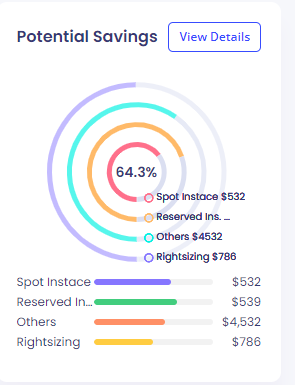

# **Appkube Reporting APIs**


## **2. _AWS Overview Dashboard_**
<br>


|  |  |
| ------ | ------ |
| API | /reporting/organization/{orgId}/spend-overview?serviceCategory=all&cloud=aws&granularity=quarterly&compareTo=-1 |
| Method | GET |
| Description | API provides service category wise actual cost of all clouds based on the given query parameters |
| Parameters |  |
+ orgId - Organization id of logged-in user. A long unique database identifier!
+ service-category 
    + all (it provides cost of every service category)
    + compute (it provides cost of compute service category)
    + storage (it provides cost of storage service category)
    + database (it provides cost of database service category)
    + networking (it provides cost of networking service category)
    + data-transfer (it provides cost of data-transfer service category)
    + monitoring (it provides cost of monitoring service category)
+ cloud - aws
    + all (get service category wise cost of all clouds)
    + aws (get service category wise cost of aws only)
    + azure (get service category wise cost of azure only)
    + gcp (get service category wise cost of gcp only)
+ granularity - quarterly
    + daily
    + weekly
    + monthly
    + quarterly
    + half-yearly
    + yearly
+ compareTo [Optional] - -1 (last_quarter, based on granularity)
    + default 0 (current day/week/month/year)    
    + -n to n (e.g -2, -1, 0) 
        + based on granularity, -1 will be last_day, last_week, last_month, last_quarter, last_year etc..

+ required parameter :-
    + orgId   
    + startDate
    + endDate

+ Query
 ```
 with s as (	
WITH ServiceCosts AS (
   SELECT
       ce.service_category,
       SUM(CAST(jb.value AS int)) AS total,
       null as percentage
   FROM
       cloud_element ce,
       landingzone l,
       department d,
       organization o,
        jsonb_each_text(ce.cost_json -> 'cost' -> 'DAILYCOST') AS jb(key, value)
   WHERE
       l.department_id = d.id
       AND d.organization_id = o.id
       AND ce.landingzone_id = l.id
       AND jb.key >= '2023-01-01' AND jb.key <= '2023-01-03'
       and upper(l.cloud) = upper('AWS')
       AND o.id = 1
       and upper(ce.service_category) = upper('')
   GROUP BY
       ce.service_category
)
SELECT service_category, total, percentage FROM ServiceCosts),
ps as ( with psum as (select sum(total) as sumall from s)	select sumall from psum),
res as (select  s.service_category, s.total, ROUND((s.total * 100.0 / ps.sumall), 2) AS percentage from s, ps
union all
select  'Grand Total' as service_category, ps.sumall as total, null as percentage from ps)
select ROW_NUMBER() OVER () as id, service_category, total, percentage from res

 ```

+ Query Output 
<table style="border:2px solid white;">
    <tr>
        <th>id</th>
        <th>service_category</th>
        <th>total</th>
        <th>percentage</th>
    </tr>
    <tr>
        <td>1</td>
        <td>COMPUTE</td>
        <td>3350718</td>
        <td>61.91</td>
    </tr>
    <tr>
        <td>2</td>
        <td>DATABASE</td>
        <td>289710</td>
        <td>5.35</td>
    </tr>
     <tr>
        <td>3</td>
        <td>STORAGE</td>
        <td>1601113</td>
        <td>29.58</td>
    </tr>
     <tr>
        <td>4</td>
        <td>OTHER</td>
        <td>170994</td>
        <td>3.16</td>
    </tr>
    <tr>
        <td>5</td>
        <td>Grand Total</td>
        <td>5412535</td>
        <td></td>
    </tr>
 </table>

<hr>      
<br><br>  


|  |  |
| ------ | ------ |
| API | /reporting/organization/{orgId}/top-used-service?service=all&cloud=aws&granularity=quarterly&compareTo=-1&noOfRecords=10&order=top |
| Method | GET |
| Description | API provides service wise actual cost of aws account based on the given query parameters |
| Parameters |  |
+ orgId - Organization id of logged-in user. A long unique database identifier!
+ service - all
    + all (it provides cost of all aws services)
    + EC2 (it provides cost of EC2 service)
    + RDS (it provides cost of RDS service)
    + S3 (it provides cost of S3 service)
    + EKS (it provides cost of EC2 service)
    + Lambda (it provides cost of Lambda service)
+ cloud - aws
    + all (get service wise actual cost of all clouds)
    + aws (get service wise actual cost of aws only)
    + azure (get service wise actual cost of azure only)
    + gcp (get service wise actual cost of gcp only)
+ granularity - quarterly
    + daily
    + weekly
    + monthly
    + quarterly
    + half-yearly
    + yearly
+ compareTo [Optional] - -1 (last_quarter, based on granularity)
    + default 0 (current day/week/month/year)    
    + -n to n (e.g -2, -1, 0) 
        + based on granularity, -1 will be last_day, last_week, last_month, last_quarter, last_year etc..
+ noOfRecords [Optional] - any +ve integer (10)
    + (default is 0. that means all records). 
    + -ve will be discarded/ignored
+ order [Optional] - (Default order - top (descending))
    + top (descending order). if noOfRecords records provided, it will be like top 10 
    + bottom (ascending order). if noOfRecords records provided, it will be like bottom 10 

+ Query
 ```
 
with p as (
 with PreviousServiceCosts as (
	select
		ce.element_type,
		SUM(cast(jb.value as int)) as total
	from
		cloud_element ce,
		landingzone l,
		department d,
		organization o,
		jsonb_each_text(ce.cost_json -> 'cost' -> 'DAILYCOST') as jb(key,
		value)
	where
		l.department_id = d.id
		and d.organization_id = o.id
		and ce.landingzone_id = l.id
		and jb.key >= '2023-07-01'
		and jb.key <= '2023-09-30'
		and o.id = 1
	group by 
		ce.element_type)
	select
		'Previous_Total' as element_type,
		SUM(total) as total
	from 
		PreviousServiceCosts), 
 ct as ( with CurrentServiceCosts as (
	select
		ce.element_type,
		SUM(cast(jb.value as int)) as total
	from
		cloud_element ce,
		landingzone l,
		department d,
		organization o,
		jsonb_each_text(ce.cost_json -> 'cost' -> 'DAILYCOST') as jb(key,
		value)
	where
		l.department_id = d.id
		and d.organization_id = o.id
		and ce.landingzone_id = l.id
		and jb.key >= '2023-10-01'
		and jb.key <= '2023-12-31'
		and o.id = 1
	group by
		ce.element_type)
	select
		'Current_Total' as element_type,
		SUM(total) as total
	from
		CurrentServiceCosts),
 ct_list as ( with CurrentServiceCosts as (
	select
		ce.element_type,
		SUM(cast(jb.value as int)) as total
	from
		cloud_element ce,
		landingzone l,
		department d,
		organization o,
		jsonb_each_text(ce.cost_json -> 'cost' -> 'DAILYCOST') as jb(key,
		value)
	where
		l.department_id = d.id
		and d.organization_id = o.id
		and ce.landingzone_id = l.id
		and jb.key >= '2023-10-01'
		and jb.key <= '2023-12-31'
		and o.id = 1
	group by
		ce.element_type)
	select
		element_type,
		total
	from
		CurrentServiceCosts
	order by total desc	limit 5)
   
 select upper(p.element_type) as element_type, p.total from p
union all
 select	upper(ct.element_type) as element_type,	ct.total from ct
union all 
 select	upper('Percentage'), round(((ct.total-p.total)/ ct.total)* 100,	2) from ct, p
union all
 select	upper(ctl.element_type), ctl.total from	ct_list ctl

 ```

+ Query Output 
<table style="border:2px solid white;">
    <tr>
        <th>element_type</th>
        <th>total</th>
    </tr>
    <tr>
        <td>PREVIOUS_TOTAL</td>
        <td>14535823</td>
    </tr>
    <tr>
        <td>CURRENT_TOTAL</td>
        <td>14542777</td>
    </tr>
     <tr>
        <td>PERCENTAGE</td>
        <td>0.05</td>
    </tr>
    <tr>
        <td>LAMBDA</td>
        <td>5465645</td>
    </tr>
    <tr>
        <td>KMS</td>
        <td>4369661</td>
    </tr>
    <tr>
        <td>APIGATEWAY</td>
        <td>2731041</td>
    </tr>
    <tr>
        <td>EC2</td>
        <td>1538199</td>
    </tr>
    <tr>
        <td>LOADBALANCER</td>
        <td>221514</td>
    </tr>
    
 </table>

<hr>
<br><br>  



|  |  |
| ------ | ------ |
| API | /reporting/organization/{orgId}/potential-savings?cloud=aws&granularity=quarterly&compareTo=-1 |
| Method | GET |
| Description | API provides estimated cost saved of aws accounts and comparative stats based on the given query |
| Parameters |  |
+ orgId - Organization id of logged-in user. A long unique database identifier!
+ cloud - aws
    + all (get estimated cost saving of all clouds)
    + aws (get estimated cost saving of aws only)
    + azure (get estimated cost saving of azure only)
    + gcp (get estimated cost saving gcp only)
+ granularity - quarterly
    + daily
    + weekly
    + monthly
    + quarterly
    + half-yearly
    + yearly
+ compareTo [Optional] - -1 (last_quarter, based on granularity)
    + default 0 (current day/week/month/year)    
    + -n to n (e.g -2, -1, 0) 
        + based on granularity, -1 will be last_day, last_week, last_month, last_quarter, last_year etc..
+ Query
 ```
    TODO: FinOps API to be integrated
 ```
 + Query Output 
<table style="border:2px solid white;">
    <tr>
        <th>instance_type</th>
        <th>total</th>
    </tr>
    <tr>
        <td>PREVIOUS_TOTAL</td>
        <td>14535823</td>
    </tr>
    <tr>
        <td>CURRENT_TOTAL</td>
        <td>14542777</td>
    </tr>
     <tr>
        <td>PERCENTAGE</td>
        <td>0.05</td>
    </tr>
    <tr>
        <td>SPOT INSTANCE</td>
        <td>5465</td>
    </tr>
    <tr>
        <td>RESERVED INSTANCE</td>
        <td>43696</td>
    </tr>
    <tr>
        <td>OTHERS</td>
        <td>2731</td>
    </tr>
    <tr>
        <td>RIGHTSIZING</td>
        <td>1538</td>
    </tr>
 </table>
<hr>
<br><br>  


|  |  |
| ------ | ------ |
| API | /reporting/organization/{orgId}/cost-top-accounts?cloud=aws&account=all&granularity=quarterly&compareTo=-1&noOfRecords=10&order=top |
| Method | GET |
| Description | API provides aws account wise actual cost and comparative stats based on the given query parameters |
| Parameters |  |
+ orgId - Organization id of logged-in user. A long unique database identifier!
+ cloud - aws
    + all (get service wise actual cost of all clouds)
    + aws (get service wise actual cost of aws only)
    + azure (get service wise actual cost of azure only)
    + gcp (get service wise actual cost of gcp only)
+ account - all
    + all (get cost of all the aws accounts)
    + 12345678 etc.. (get cost of provided ws account only)    
+ granularity - quarterly
    + daily
    + weekly
    + monthly
    + quarterly
    + half-yearly
    + yearly
+ compareTo [Optional] - -1 (last_quarter, based on granularity)
    + default 0 (current day/week/month/year)    
    + -n to n (e.g -2, -1, 0) 
        + based on granularity, -1 will be last_day, last_week, last_month, last_quarter, last_year etc..
+ noOfRecords [Optional] - any +ve integer (10)
    + (default is 0. that means all records). 
    + -ve will be discarded/ignored
+ order [Optional] - (Default order - top (descending))
    + top (descending order). if noOfRecords records provided, it will be like top 10 
    + bottom (ascending order). if noOfRecords records provided, it will be like bottom 10 
+ Query
 ```
    with budget_temp as (
		select
			b.id,
			b.allocated_budget,
			b.organization_id,
			b.status,
			b.financial_year_start,
			b.financial_year_end , 
				cast(bg.obj -> 'depId' as int) as dep_id,
			cast(bg.obj -> 'allocatedBudget' as int) as dep_allocated_budget
		from
			organization o,
			budget b,
			jsonb_array_elements(b.budget_json -> 'data') with ordinality bg(obj,
			pos)
		where
			o.id = b.organization_id
			and b.financial_year_start >= '2023-01-01'
			and b.financial_year_end <= '2023-12-31'
			and o.id = 1
	),
	ce_temp as (
		select
			o.id as organization_id,
			d.id as department_id,
			d."name" as department,
			SUM(cast(jb.value as int)) as total
			--,
		from
			cloud_element ce, 
			    landingzone l,
			    department d,
			    organization o,
			    jsonb_each_text(ce.cost_json -> 'cost' -> 'DAILYCOST') as jb(key,
			value)
			--,
		where
			l.department_id = d.id
			and d.organization_id = o.id
			and ce.landingzone_id = l.id
			and jb.key >= '2023-10-01'
			and jb.key <= '2023-12-31'
			and o.id = 1
		group by o.id, d.id, d."name"
		order by total desc
)
	select
		distinct ct.department_id,
		ct.department,
		ct.total,
		bt.dep_allocated_budget,
		(bt.dep_allocated_budget - ct.total) as budget_consumed
	from
		ce_temp ct
	left join budget_temp bt 
		on
		ct.organization_id = bt.organization_id
	where
		ct.department_id = bt.dep_id
	order by
		ct.total desc

 ```
 + Query Output 
<table style="border:2px solid white;">
    <tr>
        <th>id</th>
        <th>department</th>
        <th>total</th>
        <th>budget_allocated</th>
        <th>budget_consumed</th>
    </tr>
    <tr>
        <td>1</td>
        <td>HR</td>
        <td>10925774</td>
        <td>3000000</td>
        <td>-7925774</td>
    </tr>
    <tr>
        <td>3</td>
        <td>LOGISTICS</td>
        <td>2089358</td>
        <td>3000000</td>
        <td>910642</td>
    </tr>
    <tr>
        <td>2</td>
        <td>IT</td>
        <td>1527645</td>
        <td>2000000</td>
        <td>472355</td>
    </tr>
 </table>    
<hr>
<br><br>  


|  |  |
| ------ | ------ |
| API | /reporting/organization/{orgId}/spending-trend?cloud=aws&granularity=monthly&compareTo=-1&forcast=true |
| Method | GET |
| Description | API provides two actual costs based on the granularity along with forcasted cost. |
| Parameters |  |
+ orgId - Organization id of logged-in user. A long unique database identifier!
+ cloud - aws
    + all (get cost trend of all clouds)
    + aws (get cost trend of aws only)
    + azure (get cost trend of azure only)
    + gcp (get cost trend of gcp only)
+ granularity - monthly
    + daily
    + weekly
    + monthly
    + quarterly
    + half-yearly
    + yearly
+ weekStart[optional] - This paramer will be used if granularity is weekly. 
    + saturday
    + sunday
    + monday
+ startFrom[optional] - last_quarter, last_month, last_year, current_quarter, current_year_start or last_n_months (n = 1,2,3,4....)
+ compareTo [Optional] - -1 (last_month, based on granularity)
    + default 0 (current day/week/month/year)    
    + -n to n (e.g -2, -1, 0) 
        + based on granularity, -1 will be last_day, last_week, last_month, last_quarter, last_year etc..
+ forcast[optional] - false (default false)
    + true (will provide forcasted cost trend based on the granularity)
    + false (will provide actual cost trend based on the granularity)

+ Query
 ```
    with p as (
 	with PreviousServiceCosts as (
	select
		'previous' as tenure,
		jb.key as dates,
		SUM(cast(jb.value as int)) as total
	from
		cloud_element ce,
		landingzone l,
		department d,
		organization o,
		jsonb_each_text(ce.cost_json -> 'cost' -> 'DAILYCOST') as jb(key, value)
	where
		l.department_id = d.id
		and d.organization_id = o.id
		and ce.landingzone_id = l.id
		and jb.key >= '2023-07-01'
		and jb.key <= '2023-09-30'
		and o.id = 1
	group by 
		jb.key)
	select
		tenure,
		dates,
		total
	from 
		PreviousServiceCosts), 
 ct as ( with CurrentServiceCosts as (
	select
		'current' as tenure,
		jb.key as dates,
		SUM(cast(jb.value as int)) as total
	from
		cloud_element ce,
		landingzone l,
		department d,
		organization o,
		jsonb_each_text(ce.cost_json -> 'cost' -> 'DAILYCOST') as jb(key, value)
	where
		l.department_id = d.id
		and d.organization_id = o.id
		and ce.landingzone_id = l.id
		and jb.key >= '2023-10-01'
		and jb.key <= '2023-12-31'
		and o.id = 1
	group by
		jb.key)
	select
		tenure,
		dates,
		total
	from
		CurrentServiceCosts),
	f as ( with FutureServiceCosts as (
		SELECT 'forcast' as tenure, cast(cast (generate_series('2024-04-01'::date, '2024-06-30'::date, '1 day') as date) as text) AS dates, cast (floor(random() * 10000 + 1) as int) as total 
		)
	select
		tenure,
		dates,
		total
	from
		FutureServiceCosts),
	pmin as ( with pminimum as (select 'min' as tenure, null as dates, min(total) as total from p) select tenure, dates, total from pminimum),
	ctmin as ( with ctminimum as (select 'min' as tenure, null as dates, min(total) as total from ct) select tenure, dates, total from ctminimum),
	fmin as ( with fminimum as (select 'min' as tenure, null as dates, min(total) as total from f) select tenure, dates, total from fminimum),
	allmin as (with allminimum as (
		select tenure, dates, total from pmin
		union all 
		select tenure, dates, total from ctmin
		union all
		select tenure, dates, total from fmin
	) select 'min', null as dates, min(total) as total from allminimum),
	
	pmax as ( with pmaximum as (select 'max' as tenure, null as dates, max(total) as total from p) select tenure, dates, total from pmaximum),
	ctmax as ( with ctmaximum as (select 'max' as tenure, null as dates, max(total) as total from ct) select tenure, dates, total from ctmaximum),
	fmax as ( with fmaximum as (select 'max' as tenure, null as dates, max(total) as total from f) select tenure, dates, total from fmaximum),
	allmax as (with allmaximum as (
		select tenure, dates, total from pmax
		union all 
		select tenure, dates, total from ctmax
		union all
		select tenure, dates, total from fmax
	) select 'max', null as dates, max(total) as total from allmaximum)
	
	select 'max' as tenure, null as dates, total from allmax
	union all
	select 'min' as tenure, null as dates, total from allmin
	union all
	select 	tenure, dates,  total from p 
	union all
	select 	tenure, dates,  total from ct 
	union all
	select 	tenure, dates,  total from f order by tenure, dates asc

 ```
 + Query Output 
<table style="border:2px solid white;">
    <tr>
        <th>tenure</th>
        <th>dates</th>
        <th>total</th>
    </tr>
    <tr>
        <td>current</td>
        <td>2023-10-01</td>
        <td>157510</td>
    </tr>
    <tr>
        <td>current</td>
        <td>2023-10-01</td>
        <td>155657</td>
    </tr>
    <tr>
        <td>previous</td>
        <td>2023-07-01</td>
        <td>161610</td>
    </tr>
    <tr>
        <td>previous</td>
        <td>2023-07-02</td>
        <td>158647</td>
    </tr>
    <tr>
        <td>forcast</td>
        <td>2024-04-01</td>
        <td>9386</td>
    </tr>
    <tr>
        <td>forcast</td>
        <td>2024-04-02</td>
        <td>3866</td>
    </tr>
    <tr>
        <td>max</td>
        <td></td>
        <td>161610</td>
    </tr>
    <tr>
        <td>min</td>
        <td></td>
        <td>3866</td>
    </tr>
 </table> 

<hr>
<br><br>  


|  |  |
| ------ | ------ |
| API | /reporting/region-wise-cost?orgId=1&cloud=aws&region=all&granularity=quarterly&compareTo=-1&noOfRecords=5&order=top |
| Method | GET |
| Description | API provides region wise actual cost and comparative stats based on the given query parameters |
| Parameters |  |
+ orgId - Organization id of logged-in user. A long unique database identifier!
+ cloud - aws
    + all (get region wise actual cost of all clouds)
    + aws (get region wise actual cost of aws only)
    + azure (get region wise actual cost of azure only)
    + gcp (get region wise actual cost of gcp only)
+ granularity - quarterly
    + daily
    + weekly
    + monthly
    + quarterly
    + half-yearly
    + yearly
+ compareTo [Optional] - -1 (last_quarter, based on granularity)
    + default 0 (current day/week/month/year)    
    + -n to n (e.g -2, -1, 0) 
        + based on granularity, -1 will be last_day, last_week, last_month, last_quarter, last_year etc..
+ noOfRecords [Optional] - any +ve integer (5)
    + (default is 0. that means all records). 
    + -ve will be discarded/ignored
+ order [Optional] - (Default order - top (descending))
    + top (descending order). if noOfRecords records provided, it will be like top 10 
    + bottom (ascending order). if noOfRecords records provided, it will be like bottom 10 
<hr>
<br><br>  


## **3. _AWS COST Central Dashboard_**
<br>


|  |  |
| ------ | ------ |
| API | /reporting/current-month-cost?orgId=1&cloud=aws |
| Method | GET |
| Description | API provides current month's cost/spend and consumed budget till date out of total allocated budget based on the given query parameters |
| Parameters |  |
+ orgId - Organization id of logged-in user. A long unique database identifier!
+ cloud - aws
    + all (get region wise actual cost of all clouds)
    + aws (get region wise actual cost of aws only)
    + azure (get region wise actual cost of azure only)
    + gcp (get region wise actual cost of gcp only)
<hr>
<br><br>  


|  |  |
| ------ | ------ |
| API | /reporting/cost?orgId=1&cloud=aws&granularity=monthly&compareTo=-1&spendType=forcast |
| Method | GET |
| Description | API provides current month's forcasted cost of all aws accounts and comparative stats based on the given query parameters |
| Parameters |  |
+ orgId - Organization id of logged-in user. A long unique database identifier!
+ cloud - aws 
    + all (get consolidated cost of all clouds)
    + aws (get consolidated cost of aws only)
    + azure (get consolidated cost of azure only)
    + gcp (get consolidated cost of gcp only)
+ granularity - monthly
    + daily
    + weekly
    + monthly
    + quarterly
    + half-yearly
    + yearly
+ compareTo [Optional] - -1 (last_month, based on granularity)
    + default 0 (current day/week/month/year)    
    + -n to n (e.g -2, -1, 0) 
        + based on granularity, -1 will be last_day, last_week, last_month, last_quarter, last_year etc..
+ spendType [Optional] - If spendType is not provided, default will be actual
    + actual - Provide actual cost 
    + forcast - Provide forcasted cost
<hr>
<br><br>  


|  |  |
| ------ | ------ |
| API | /reporting/cost-trend?orgId=1&cloud=aws&granularity=monthly&startFrom=-2&compareTo=-1&forcast=false |
| Method | GET |
| Description | API provides actual cost trend based on the given query parameters |
| Parameters |  |
+ orgId - Organization id of logged-in user. A long unique database identifier!
+ cloud - aws
    + all (get cost trend of all clouds)
    + aws (get cost trend of aws only)
    + azure (get cost trend of azure only)
    + gcp (get cost trend of gcp only)
+ granularity - monthly
    + daily
    + weekly
    + monthly
    + quarterly
    + half-yearly
    + yearly
+ weekStart[optional] - This paramer will be used if granularity is weekly. 
    + saturday
    + sunday
    + monday
+ startFrom[optional] - -2
    + last_quarter, last_month, last_year, current_quarter, current_year_start or 
    + -n to n (e.g. n = -4, -3, -2, -1, 0, 1,2,3,4....)
+ compareTo [Optional] - -1 (last_month, based on granularity)
    + default 0 (current day/week/month/year)    
    + -n to n (e.g -2, -1, 0) 
        + based on granularity, -1 will be last_day, last_week, last_month, last_quarter, last_year etc..
+ forcast[optional] - false (default false)
    + true (will provide forcasted cost trend based on the granularity)
    + false (will provide actual cost trend based on the granularity)
<hr>
<br><br>  


|  |  |
| ------ | ------ |
| API | /reporting/cost-trend?orgId=1&cloud=aws&granularity=yearly&startFrom=-1&compareTo=0&forcast=false |
| Method | GET |
| Description | API provides actual cost trend based on the given query parameters |
| Parameters |  |
+ orgId - Organization id of logged-in user. A long unique database identifier!
+ cloud - aws
    + all (get cost trend of all clouds)
    + aws (get cost trend of aws only)
    + azure (get cost trend of azure only)
    + gcp (get cost trend of gcp only)
+ granularity - yearly
    + daily
    + weekly
    + monthly
    + quarterly
    + half-yearly
    + yearly
+ weekStart[optional] - This paramer will be used if granularity is weekly. 
    + saturday
    + sunday
    + monday
+ startFrom[optional] - -1 (last_month)
    + last_quarter, last_month, last_year, current_quarter, current_year_start or 
    + -n to n (e.g. n = -4, -3, -2, -1, 0, 1,2,3,4....)
+ compareTo [Optional] - 0 (current_year, based on granularity)
    + default 0 (current day/week/month/year)    
    + -n to n (e.g -2, -1, 0) 
        + based on granularity, -1 will be last_day, last_week, last_month, last_quarter, last_year etc..
+ forcast[optional] - false (default false)
    + true (will provide forcasted cost trend based on the granularity)
    + false (will provide actual cost trend based on the granularity)
<hr>
<br><br>  


|  |  |
| ------ | ------ |
| API | /reporting/service-wise-cost?orgId=1&service=all&cloud=aws&granularity=monthly&noOfRecords=10&order=top |
| Method | GET |
| Description | API provides current month's service wise actual cost of aws accounts based on the given query parameters |
| Parameters |  |
+ orgId - Organization id of logged-in user. A long unique database identifier!
+ service - all
    + all (it provides cost of all aws services)
    + EC2 (it provides cost of EC2 service)
    + RDS (it provides cost of RDS service)
    + S3 (it provides cost of S3 service)
    + EKS (it provides cost of EC2 service)
    + Lambda (it provides cost of Lambda service)
+ cloud - aws
    + all (get service wise actual cost of all clouds)
    + aws (get service wise actual cost of aws only)
    + azure (get service wise actual cost of azure only)
    + gcp (get service wise actual cost of gcp only)
+ granularity - monthly
    + daily
    + weekly
    + monthly
    + quarterly
    + half-yearly
    + yearly
+ compareTo [Optional] -
    + default 0 (current day/week/month/year)    
    + -n to n (e.g -2, -1, 0) 
        + based on granularity, -1 will be last_day, last_week, last_month, last_quarter, last_year etc..
+ noOfRecords [Optional] - any +ve integer (10)
    + (default is 0. that means all records). 
    + -ve will be discarded/ignored
+ order [Optional] - (Default order - top (descending))
    + top (descending order). if noOfRecords records provided, it will be like top 10 
    + bottom (ascending order). if noOfRecords records provided, it will be like bottom 10 
<hr>
<br><br>  


|  |  |
| ------ | ------ |
| API | /reporting/account-wise-cost?orgId=1&cloud=aws&account=all&granularity=monthly&noOfRecords=5&order=top |
| Method | GET |
| Description | API provides top 5 aws account wise actual cost based on the given query parameters |
| Parameters |  |
+ orgId - Organization id of logged-in user. A long unique database identifier!
+ cloud - aws
    + all (get service wise actual cost of all clouds)
    + aws (get service wise actual cost of aws only)
    + azure (get service wise actual cost of azure only)
    + gcp (get service wise actual cost of gcp only)
+ account - all
    + all (get cost of all the aws accounts)
    + 12345678 etc.. (get cost of provided ws account only)    
+ granularity - monthly
    + daily
    + weekly
    + monthly
    + quarterly
    + half-yearly
    + yearly
+ compareTo [Optional] - 
    + default 0 (current day/week/month/year)    
    + -n to n (e.g -2, -1, 0) 
        + based on granularity, -1 will be last_day, last_week, last_month, last_quarter, last_year etc..
+ noOfRecords [Optional] - any +ve integer (5)
    + (default is 0. that means all records). 
    + -ve will be discarded/ignored
+ order [Optional] - (Default order - top (descending))
    + top (descending order). if noOfRecords records provided, it will be like top 10 
    + bottom (ascending order). if noOfRecords records provided, it will be like bottom 10 
<hr>
<br><br>  


|  |  |
| ------ | ------ |
| API | /reporting/region-wise-cost?orgId=1&cloud=aws&region=all&granularity=monthlynoOfRecords=5&order=top |
| Method | GET |
| Description | API provides top 5 aws region wise actual cost based on the given query parameters |
| Parameters |  |
+ orgId - Organization id of logged-in user. A long unique database identifier!
+ cloud - aws
    + all (get region wise actual cost of all clouds)
    + aws (get region wise actual cost of aws only)
    + azure (get region wise actual cost of azure only)
    + gcp (get region wise actual cost of gcp only)
+ granularity - monthly
    + daily
    + weekly
    + monthly
    + quarterly
    + half-yearly
    + yearly
+ compareTo [Optional] - 
    + default 0 (current day/week/month/year)    
    + -n to n (e.g -2, -1, 0) 
        + based on granularity, -1 will be last_day, last_week, last_month, last_quarter, last_year etc..
+ noOfRecords [Optional] - any +ve integer (5)
    + (default is 0. that means all records). 
    + -ve will be discarded/ignored
+ order [Optional] - (Default order - top (descending))
    + top (descending order). if noOfRecords records provided, it will be like top 10 
    + bottom (ascending order). if noOfRecords records provided, it will be like bottom 10 
<hr>
<br><br>


|  |  |
| ------ | ------ |
| API | /reporting/product-wise-cost?orgId=1&cloud=aws&product=all&granularity=monthly&noOfRecords=5&order=top |
| Method | GET |
| Description | API provides top 5 product wise actual cost of aws accouts based on the given query parameters |
| Parameters |  |
+ orgId - Organization id of logged-in user. A long unique database identifier!
+ cloud - aws
    + all (get region wise actual cost of all clouds)
    + aws (get region wise actual cost of aws only)
    + azure (get region wise actual cost of azure only)
    + gcp (get region wise actual cost of gcp only)
+ product - all
    + all (get cost of all the products)
    + Procurement etc.. (get cost of provided product only)    
+ granularity - monthly
    + daily
    + weekly
    + monthly
    + quarterly
    + half-yearly
    + yearly
+ compareTo [Optional] - 
    + default 0 (current day/week/month/year)    
    + -n to n (e.g -2, -1, 0) 
        + based on granularity, -1 will be last_day, last_week, last_month, last_quarter, last_year etc..
+ noOfRecords [Optional] - any +ve integer (5)
    + (default is 0. that means all records). 
    + -ve will be discarded/ignored
+ order [Optional] - (Default order - top (descending))
    + top (descending order). if noOfRecords records provided, it will be like top 10 
    + bottom (ascending order). if noOfRecords records provided, it will be like bottom 10 
<hr>
<br><br>


|  |  |
| ------ | ------ |
| API | /reporting/service-type-wise-cost?orgId=1&serviceType=all&cloud=aws&granularity=monthly |
| Method | GET |
| Description | API provides service type wise actual cost of aws accounts based on the given query parameters |
| Parameters |  |
+ orgId - Organization id of logged-in user. A long unique database identifier!
+ cloud - aws
    + all (get region wise actual cost of all clouds)
    + aws (get region wise actual cost of aws only)
    + azure (get region wise actual cost of azure only)
    + gcp (get region wise actual cost of gcp only)
+ serviceType - all
    + all (it provides cost of all service types)
    + App (it provides cost of App service)
    + Data (it provides cost of Data service)
    + Network (it provides cost of Network service)
    + Other (it provides cost of Other service)    
+ granularity - monthly
    + daily
    + weekly
    + monthly
    + quarterly
    + half-yearly
    + yearly
+ compareTo [Optional] - 
    + default 0 (current day/week/month/year)    
    + -n to n (e.g -2, -1, 0) 
        + based on granularity, -1 will be last_day, last_week, last_month, last_quarter, last_year etc..
+ noOfRecords [Optional] - any +ve integer (5)
    + (default is 0. that means all records). 
    + -ve will be discarded/ignored
+ order [Optional] - (Default order - top (descending))
    + top (descending order). if noOfRecords records provided, it will be like top 10 
    + bottom (ascending order). if noOfRecords records provided, it will be like bottom 10 
<hr>
<br><br>


**After click on Top 5 Regions**


|  |  |
| ------ | ------ |
| API | /reporting/region-wise-cost-details?orgId=1&cloud=aws&region=all&granularity=monthly&noOfRecords=5&order=top |
| Method | GET |
| Description | API provides top 5 aws region wise actual cost details based on the given query parameters |
| Parameters |  |
+ orgId - Organization id of logged-in user. A long unique database identifier!
+ cloud - aws
    + all (get region wise actual cost of all clouds)
    + aws (get region wise actual cost of aws only)
    + azure (get region wise actual cost of azure only)
    + gcp (get region wise actual cost of gcp only)
+ granularity - monthly
    + daily
    + weekly
    + monthly
    + quarterly
    + half-yearly
    + yearly
+ compareTo [Optional] - 
    + default 0 (current day/week/month/year)    
    + -n to n (e.g -2, -1, 0) 
        + based on granularity, -1 will be last_day, last_week, last_month, last_quarter, last_year etc..
+ noOfRecords [Optional] - any +ve integer (5)
    + (default is 0. that means all records). 
    + -ve will be discarded/ignored
+ order [Optional] - (Default order - top (descending))
    + top (descending order). if noOfRecords records provided, it will be like top 10 
    + bottom (ascending order). if noOfRecords records provided, it will be like bottom 10 
<hr>
<br><br>


**After click on Top 10 Service Used**


|  |  |
| ------ | ------ |
| API | /reporting/service-wise-cost-details?orgId=1&service=all&cloud=aws&granularity=monthly&noOfRecords=10&order=top |
| Method | GET |
| Description | API provides current month's service wise actual cost details of aws accounts based on the given query parameters |
| Parameters |  |
+ orgId - Organization id of logged-in user. A long unique database identifier!
+ service - all
    + all (it provides cost of all aws services)
    + EC2 (it provides cost of EC2 service)
    + RDS (it provides cost of RDS service)
    + S3 (it provides cost of S3 service)
    + EKS (it provides cost of EC2 service)
    + Lambda (it provides cost of Lambda service)
+ cloud - aws
    + all (get service wise actual cost of all clouds)
    + aws (get service wise actual cost of aws only)
    + azure (get service wise actual cost of azure only)
    + gcp (get service wise actual cost of gcp only)
+ granularity - monthly
    + daily
    + weekly
    + monthly
    + quarterly
    + half-yearly
    + yearly
+ compareTo [Optional] - 
    + default 0 (current day/week/month/year)    
    + -n to n (e.g -2, -1, 0) 
        + based on granularity, -1 will be last_day, last_week, last_month, last_quarter, last_year etc..
+ noOfRecords [Optional] - any +ve integer (10)
    + (default is 0. that means all records). 
    + -ve will be discarded/ignored
+ order [Optional] - (Default order - top (descending))
    + top (descending order). if noOfRecords records provided, it will be like top 10 
    + bottom (ascending order). if noOfRecords records provided, it will be like bottom 10 
<hr>
<br><br>  


