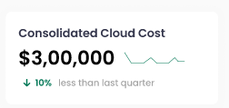
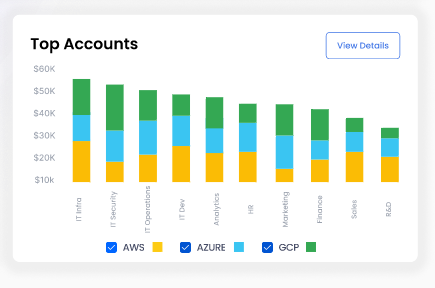
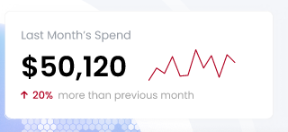
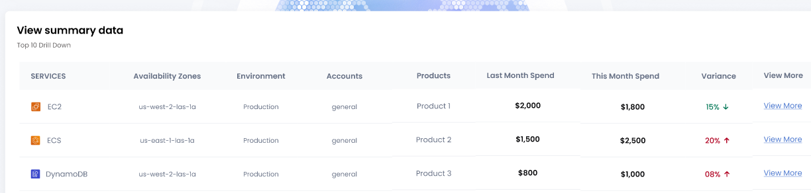

# **Appkube Reporting APIs**

## **1. _Overview Dashboard_**  
   

|  |  |
| ------ | ------ |
| API | /reporting/cost?orgId=1&cloud=all&granularity=quarterly&compareTo=-1&spendType=actual |
| Method | GET |
| Description | API provides actual consolidated cost of all the clouds and comparative stats based on the given query parameters |
| Parameters |  |
+ orgId - Organization id of logged-in user. A long unique database identifier!
+ cloud - all
    + all (get consolidated cost of all clouds)
    + aws (get consolidated cost of aws only)
    + azure (get consolidated cost of azure only)
    + gcp (get consolidated cost of gcp only)
+ granularity - quarterly
    + daily
    + weekly
    + monthly
    + quarterly
    + half-yearly
    + yearly
+ compareTo [Optional] - -1 (last_quarter, based on granularity)
    + default 0 (current day/week/month/year)    
    + -n to n (e.g -2, -1, 0) 
        + based on granularity, -1 will be last_day, last_week, last_month, last_quarter, last_year etc.. 
+ spendType [Optional] - If spendType is not provided, default will be actual
    + actual - Provide actual cost 
    + forcast - Provide forcasted cost  

Response  

    {
        "label": "Consolidated Cloud Cost",
        "granularity": "quarterly"
        "compareTo": "previousQuarter",
        "spendType": "actual",
        "cloud": "all",
        "cost": {
            "current":{
                "label":"quarter",
                "from":"yyyy-mm-dd",
                "to": "yyyy-mm-dd"
                "amount":"400"
            },
            "previous":{
                "label":"quarter",
                "from":"yyyy-mm-dd",
                "to": "yyyy-mm-dd"
                "amount":"380"
            },
            "difference":{
                "amount":"20",
                "percentVariation":"5.2%"
            }
            "message": "with respect to previous quarter, current quarter cost increased by $20"
        },
        "currency":{
            "code": "USD",
            "symbol" : "$"
        },
        "organization": {
            "id" : 1,
            "name": "Synectiks"
        }
    }  
    
Pseudo Code  

    1. call aswsx api to get current quarter cost of all landing zones of given organization
    2. call cmdb api to collect previous quarter cost of all landing zones of given organization
    3. repeat step 1 to 2 for other clouds
    4. add current quarter cost of all accounts
    5. add previous quarter cost of all accounts
    6. calculate diffrence. sum of current quarter cost - sum of previous quarter cost
    7. calculate percentage variation.  
        ((sum of current quarter cost - sum of previous quarter cost) / sum of previous quarter cost) * 100
    8. create response and return
    
      
Proposed Data-Model Changes  

    NIL      

    

|  |  |
| ------ | ------ |
| API | /reporting/cost?orgId=1&cloud=aws&granularity=quarterly&compareTo=-1&spendType=actual |
| Method | GET |
| Description | API provides actual consolidated cost of all aws accounts and comparative stats based on the given query parameters |
| Parameters |  |
+ orgId - Organization id of logged-in user. A long unique database identifier!
+ cloud - aws 
    + all (get consolidated cost of all clouds)
    + aws (get consolidated cost of aws only)
    + azure (get consolidated cost of azure only)
    + gcp (get consolidated cost of gcp only)
+ granularity - quarterly
    + daily
    + weekly
    + monthly
    + quarterly
    + half-yearly
    + yearly
+ compareTo [Optional] - -1 (last_quarter, based on granularity)
    + default 0 (current day/week/month/year)    
    + -n to n (e.g -2, -1, 0) 
        + based on granularity, -1 will be last_day, last_week, last_month, last_quarter, last_year etc..
+ spendType [Optional] - If spendType is not provided, default will be actual
    + actual - Provide actual cost 
    + forcast - Provide forcasted cost

Response  

    {
        "label": "Aws Cost",
        "granularity": "quarterly"
        "compareTo": "previousQuarter",
        "spendType": "actual",
        "cloud": "aws",
        "cost": {
            "current":{
                "label":"quarter",
                "from":"yyyy-mm-dd",
                "to": "yyyy-mm-dd"
                "amount":"400"
            },
            "previous":{
                "label":"quarter",
                "from":"yyyy-mm-dd",
                "to": "yyyy-mm-dd"
                "amount":"380"
            },
            "difference":{
                "amount":"20",
                "percentVariation":"5.2%"
            }
            "message": "with respect to previous quarter, current quarter cost increased by $20"
        },
        "currency":{
            "code": "USD",
            "symbol" : "$"
        },
        "organization": {
            "id" : 1,
            "name": "Synectiks"
        }
    }  
    
Pseudo Code  

    1. call aswsx api to get current quarter cost of all landing zones of aws of given organization
    2. call cmdb api to collect previous quarter cost of all landing zones of aws of given organization
    3. add current quarter cost of all accounts
    4. add previous quarter cost of all accounts
    5. calculate diffrence. sum of current quarter cost - sum of previous quarter cost
    6. calculate percentage variation.  
        ((sum of current quarter cost - sum of previous quarter cost) / sum of previous quarter cost) * 100
    7. create response and return
    
      
Proposed Data-Model Changes  

    NIL      

    

|  |  |
| ------ | ------ |
| API | /reporting/cost?orgId=1&cloud=azure&granularity=quarterly&compareTo=-1&spendType=actual |
| Method | GET |
| Description | API provides actual consolidated cost of all azure accounts and comparative stats based on the given query parameters |
| Parameters |  |
+ orgId - Organization id of logged-in user. A long unique database identifier!
+ cloud - azure
    + all (get consolidated cost of all clouds)
    + aws (get consolidated cost of aws only)
    + azure (get consolidated cost of azure only)
    + gcp (get consolidated cost of gcp only)
+ granularity - quarterly
    + daily
    + weekly
    + monthly
    + quarterly
    + half-yearly
    + yearly
+ compareTo [Optional] - -1 (last_quarter, based on granularity)
    + default 0 (current day/week/month/year)    
    + -n to n (e.g -2, -1, 0) 
        + based on granularity, -1 will be last_day, last_week, last_month, last_quarter, last_year etc..
+ spendType [Optional] - If spendType is not provided, default will be actual
    + actual - Provide actual cost 
    + forcast - Provide forcasted cost

Response  

    {
        "label": "Azure Cost",
        "granularity": "quarterly"
        "compareTo": "previousQuarter",
        "spendType": "actual",
        "cloud": "azure",
        "cost": {
            "current":{
                "label":"quarter",
                "from":"yyyy-mm-dd",
                "to": "yyyy-mm-dd"
                "amount":"400"
            },
            "previous":{
                "label":"quarter",
                "from":"yyyy-mm-dd",
                "to": "yyyy-mm-dd"
                "amount":"380"
            },
            "difference":{
                "amount":"20",
                "percentVariation":"5.2%"
            }
            "message": "with respect to previous quarter, current quarter cost increased by $20"
        },
        "currency":{
            "code": "USD",
            "symbol" : "$"
        },
        "organization": {
            "id" : 1,
            "name": "Synectiks"
        }
    }  
    
Pseudo Code  

    1. call aswsx api to get current quarter cost of all landing zones of azure of given organization
    2. call cmdb api to collect previous quarter cost of all landing zones of azure of given organization
    3. add current quarter cost of all accounts
    4. add previous quarter cost of all accounts
    5. calculate diffrence. sum of current quarter cost - sum of previous quarter cost
    6. calculate percentage variation.  
        ((sum of current quarter cost - sum of previous quarter cost) / sum of previous quarter cost) * 100
    7. create response and return
    
      
Proposed Data-Model Changes  

    NIL      

    

|  |  |
| ------ | ------ |
| API | /reporting/cost?orgId=1&cloud=gcp&granularity=quarterly&compareTo=-1&spendType=actual |
| Method | GET |
| Description | API provides actual consolidated cost of all gcp accounts and comparative stats based on the given query parameters |
| Parameters |  |
+ orgId - Organization id of logged-in user. A long unique database identifier!
+ cloud - gcp
    + all (get consolidated cost of all clouds)
    + aws (get consolidated cost of aws only)
    + azure (get consolidated cost of azure only)
    + gcp (get consolidated cost of gcp only)
+ granularity - quarterly
    + daily
    + weekly
    + monthly
    + quarterly
    + half-yearly
    + yearly
+ compareTo [Optional] - -1 (last_quarter, based on granularity)
    + default 0 (current day/week/month/year)    
    + -n to n (e.g -2, -1, 0) 
        + based on granularity, -1 will be last_day, last_week, last_month, last_quarter, last_year etc..
+ spendType [Optional] - If spendType is not provided, default will be actual
    + actual - Provide actual cost 
    + forcast - Provide forcasted cost

Response  

    {
        "label": "GCP Cost",
        "granularity": "quarterly"
        "compareTo": "previousQuarter",
        "spendType": "actual",
        "cloud": "gcp",
        "cost": {
            "current":{
                "label":"quarter",
                "from":"yyyy-mm-dd",
                "to": "yyyy-mm-dd"
                "amount":"400"
            },
            "previous":{
                "label":"quarter",
                "from":"yyyy-mm-dd",
                "to": "yyyy-mm-dd"
                "amount":"380"
            },
            "difference":{
                "amount":"20",
                "percentVariation":"5.2%"
            }
            "message": "with respect to previous quarter, current quarter cost increased by $20"
        },
        "currency":{
            "code": "USD",
            "symbol" : "$"
        },
        "organization": {
            "id" : 1,
            "name": "Synectiks"
        }
    }  
    
Pseudo Code  

    1. call aswsx api to get current quarter cost of all landing zones of gcp of given organization
    2. call cmdb api to collect previous quarter cost of all landing zones of gcp of given organization
    3. add current quarter cost of all accounts
    4. add previous quarter cost of all accounts
    5. calculate diffrence. sum of current quarter cost - sum of previous quarter cost
    6. calculate percentage variation.  
        ((sum of current quarter cost - sum of previous quarter cost) / sum of previous quarter cost) * 100
    7. create response and return
    
      
Proposed Data-Model Changes  

    NIL      

    

|  |  |
| ------ | ------ |
| API | /reporting/estimated-cost-saving?orgId=1&cloud=all&granularity=quarterly&compareTo=-1 |
| Method | GET |
| Description | API provides estimated cost saved and comparative stats based on the given query |
| Parameters |  |
+ orgId - Organization id of logged-in user. A long unique database identifier!
+ cloud - all
    + all (get estimated cost saving of all clouds)
    + aws (get estimated cost saving of aws only)
    + azure (get estimated cost saving of azure only)
    + gcp (get estimated cost saving gcp only)
+ granularity - quarterly
    + daily
    + weekly
    + monthly
    + quarterly
    + half-yearly
    + yearly
+ compareTo [Optional] - -1 (last_quarter, based on granularity)
    + default 0 (current day/week/month/year)    
    + -n to n (e.g -2, -1, 0) 
        + based on granularity, -1 will be last_day, last_week, last_month, last_quarter, last_year etc..

Response  

    {
        "label": "Estimated savings of all clouds",
        "granularity": "quarterly"
        "compareTo": "previousQuarter",
        "spendType": "actual",
        "cloud": "all",
        "cost": {
            "current":{
                "label":"quarter",
                "from":"yyyy-mm-dd",
                "to": "yyyy-mm-dd"
                "amount":"400"
            },
            "previous":{
                "label":"quarter",
                "from":"yyyy-mm-dd",
                "to": "yyyy-mm-dd"
                "amount":"380"
            },
            "difference":{
                "amount":"20",
                "percentVariation":"5.2%"
            }
            "message": "with respect to previous quarter, current quarter savings increased by $20"
        },
        "currency":{
            "code": "USD",
            "symbol" : "$"
        },
        "organization": {
            "id" : 1,
            "name": "Synectiks"
        }
    }  
    
Pseudo Code  

    TO DO: Algorithem Required to calculate estimated savings for each cloud
       
Proposed Data-Model Changes  

    TO DO: Will be decided later, based on the provided algorithem       

    

|  |  |
| ------ | ------ |
| API | /reporting/service-category-wise-cost?orgId=1&service-category=all&cloud=all&granularity=quarterly |
| Method | GET |
| Description | API provides service category wise actual cost of all clouds based on the given query parameters |
| Parameters |  |
+ orgId - Organization id of logged-in user. A long unique database identifier!
+ service-category 
    + all (it provides cost of every service category)
    + compute (it provides cost of compute service category)
    + storage (it provides cost of storage service category)
    + database (it provides cost of database service category)
    + networking (it provides cost of networking service category)
    + data-transfer (it provides cost of data-transfer service category)
    + monitoring (it provides cost of monitoring service category)
+ cloud - all
    + all (get service category wise cost of all clouds)
    + aws (get service category wise cost of aws only)
    + azure (get service category wise cost of azure only)
    + gcp (get service category wise cost of gcp only)
+ granularity - quarterly
    + daily
    + weekly
    + monthly
    + quarterly
    + half-yearly
    + yearly
+ compareTo [Optional] - -1 (last_quarter, based on granularity)
    + default 0 (current day/week/month/year)    
    + -n to n (e.g -2, -1, 0) 
        + based on granularity, -1 will be last_day, last_week, last_month, last_quarter, last_year etc..

Response  

    {
        "label": "Top Service Categories",
        "label": "Service category-wise cost of all clouds",
        "granularity": "quarterly"
        "spendType": "actual",
        "cloud": "all",
        "dateTimeRange": {
            "from":"yyyy-mm-dd hh:mm:ss",
            "to": "yyyy-mm-dd hh:mm:ss"        
        },
        "order":"high to low",
        "cost": {
            "aws":{
                "compute":"1000",
                "storage":"900",
                "database":"800",
                "networking":"700",
                "data transfers":"600",
                "monitoring":"500"
            },
            "azure":{
                "compute":"1000",
                "storage":"900",
                "database":"800",
                "networking":"700",
                "data transfers":"600",
                "monitoring":"500"
            },
            "gcp":{
                "compute":"1000",
                "storage":"900",
                "database":"800",
                "networking":"700",
                "data transfers":"600",
                "monitoring":"500"
            }
        },
        "colorCode":{
            "aws": {
                "text":"amber",
                "hex":""
            },
            "azure": {
                "text":"skyblue",
                "hex":""
            },
            "gcp": {
                "text":"darkgreen",
                "hex":""
            }       
        },
        "currency":{
            "code": "USD",
            "symbol" : "$"
        },
        "organization": {
            "id" : 1,
            "name": "Synectiks"
        }
    }  
    
Pseudo Code  

    1. call aswsx api to get service category-wise cost of all landing zones of aws of given organization for given query parameters
    3. repeat step 1 for other clouds like Azure, GCP etc..
    4. maintain the list in descending order of cost for each cloud
    5. create response and return
       
Proposed Data-Model Changes  

    NIL       

    

|  |  |
| ------ | ------ |
| API | /reporting/cost-trend?orgId=1&cloud=all&granularity=weekly&weekStart=saturday&startFrom=-1&compareTo=-1&forcast=false |
| Method | GET |
| Description | API provides actual cost trend based on the given query parameters |
| Parameters |  |
+ orgId - Organization id of logged-in user. A long unique database identifier!
+ cloud - all
    + all (get cost trend of all clouds)
    + aws (get cost trend of aws only)
    + azure (get cost trend of azure only)
    + gcp (get cost trend of gcp only)
+ granularity - weekly
    + daily
    + weekly
    + monthly
    + quarterly
    + half-yearly
    + yearly
+ weekStart[optional] - This paramer will be used if granularity is weekly. 
    + saturday
    + sunday
    + monday
+ startFrom[optional] - last_quarter, last_month, last_year, current_quarter, current_year_start or last_n_months (n = -4, -3, -2, -1, 0,1, 2,3,4....)
+ compareTo [Optional] - -1 (last_quarter, based on granularity)
    + default 0 (current day/week/month/year)    
    + -n to n (e.g -2, -1, 0) 
        + based on granularity, -1 will be last_day, last_week, last_month, last_quarter, last_year etc..
+ forcast[optional] - false (default false)
    + true (will provide forcasted cost trend based on the granularity)
    + false (will provide actual cost trend based on the granularity)

    

|  |  |
| ------ | ------ |
| API | /reporting/cost-saving-distribution?orgId=1&cloud=all&granularity=quarterly |
| Method | GET |
| Description | API provides by wich strategy, how much cost saved based on the given query parameters |
| Parameters |  |
+ orgId - Organization id of logged-in user. A long unique database identifier!
+ cloud - all
    + all (get cost trend of all clouds)
    + aws (get cost trend of aws only)
    + azure (get cost trend of azure only)
    + gcp (get cost trend of gcp only)
+ granularity - quarterly
    + daily
    + weekly
    + monthly
    + quarterly
    + half-yearly
    + yearly
+ compareTo [Optional] - -1 (last_quarter, based on granularity)
    + default 0 (current day/week/month/year)    
    + -n to n (e.g -2, -1, 0) 
        + based on granularity, -1 will be last_day, last_week, last_month, last_quarter, last_year etc..

    

|  |  |
| ------ | ------ |
| API | /reporting/region-wise-cost?orgId=1&cloud=all&region=all&granularity=quarterly&compareTo=-1&noOfRecords=10&order=top |
| Method | GET |
| Description | API provides region wise actual cost and comparative stats based on the given query parameters |
| Parameters |  |
+ orgId - Organization id of logged-in user. A long unique database identifier!
+ cloud - all
    + all (get region wise actual cost of all clouds)
    + aws (get region wise actual cost of aws only)
    + azure (get region wise actual cost of azure only)
    + gcp (get region wise actual cost of gcp only)
+ granularity - quarterly
    + daily
    + weekly
    + monthly
    + quarterly
    + half-yearly
    + yearly
+ compareTo [Optional] - -1 (last_quarter, based on granularity)
    + default 0 (current day/week/month/year)    
    + -n to n (e.g -2, -1, 0) 
        + based on granularity, -1 will be last_day, last_week, last_month, last_quarter, last_year etc..
+ noOfRecords [Optional] - any +ve integer (10)
    + (default is 0. that means all records). 
    + -ve will be discarded/ignored
+ order [Optional] - (Default order - top (descending))
    + top (descending order). if noOfRecords records provided, it will be like top 10 
    + bottom (ascending order). if noOfRecords records provided, it will be like bottom 10 

    

|  |  |
| ------ | ------ |
| API | /reporting/account-wise-cost?orgId=1&cloud=all&account=all&granularity=quarterly&compareTo=-1&noOfRecords=10&order=top |
| Method | GET |
| Description | API provides account wise actual cost and comparative stats based on the given query parameters |
| Parameters |  |
+ orgId - Organization id of logged-in user. A long unique database identifier!
+ cloud - all
    + all (get region wise actual cost of all clouds)
    + aws (get region wise actual cost of aws only)
    + azure (get region wise actual cost of azure only)
    + gcp (get region wise actual cost of gcp only)
+ granularity - quarterly
    + daily
    + weekly
    + monthly
    + quarterly
    + half-yearly
    + yearly
+ compareTo [Optional] - -1 (last_quarter, based on granularity)
    + default 0 (current day/week/month/year)    
    + -n to n (e.g -2, -1, 0) 
        + based on granularity, -1 will be last_day, last_week, last_month, last_quarter, last_year etc..
+ noOfRecords [Optional] - any +ve integer (10)
    + (default is 0. that means all records). 
    + -ve will be discarded/ignored
+ order [Optional] - (Default order - top (descending))
    + top (descending order). if noOfRecords records provided, it will be like top 10 
    + bottom (ascending order). if noOfRecords records provided, it will be like bottom 10 

    

## **2. _AWS Overview Dashboard_**
 

|  |  |
| ------ | ------ |
| API | /reporting/service-category-wise-cost?orgId=1&service-category=all&cloud=aws&granularity=quarterly&compareTo=-1 |
| Method | GET |
| Description | API provides service category wise actual cost of all clouds based on the given query parameters |
| Parameters |  |
+ orgId - Organization id of logged-in user. A long unique database identifier!
+ service-category 
    + all (it provides cost of every service category)
    + compute (it provides cost of compute service category)
    + storage (it provides cost of storage service category)
    + database (it provides cost of database service category)
    + networking (it provides cost of networking service category)
    + data-transfer (it provides cost of data-transfer service category)
    + monitoring (it provides cost of monitoring service category)
+ cloud - aws
    + all (get service category wise cost of all clouds)
    + aws (get service category wise cost of aws only)
    + azure (get service category wise cost of azure only)
    + gcp (get service category wise cost of gcp only)
+ granularity - quarterly
    + daily
    + weekly
    + monthly
    + quarterly
    + half-yearly
    + yearly
+ compareTo [Optional] - -1 (last_quarter, based on granularity)
    + default 0 (current day/week/month/year)    
    + -n to n (e.g -2, -1, 0) 
        + based on granularity, -1 will be last_day, last_week, last_month, last_quarter, last_year etc..

    

|  |  |
| ------ | ------ |
| API | /reporting/service-wise-cost?orgId=1&service=all&cloud=aws&granularity=quarterly&compareTo=-1&noOfRecords=10&order=top |
| Method | GET |
| Description | API provides service wise actual cost of aws account based on the given query parameters |
| Parameters |  |
+ orgId - Organization id of logged-in user. A long unique database identifier!
+ service - all
    + all (it provides cost of all aws services)
    + EC2 (it provides cost of EC2 service)
    + RDS (it provides cost of RDS service)
    + S3 (it provides cost of S3 service)
    + EKS (it provides cost of EC2 service)
    + Lambda (it provides cost of Lambda service)
+ cloud - aws
    + all (get service wise actual cost of all clouds)
    + aws (get service wise actual cost of aws only)
    + azure (get service wise actual cost of azure only)
    + gcp (get service wise actual cost of gcp only)
+ granularity - quarterly
    + daily
    + weekly
    + monthly
    + quarterly
    + half-yearly
    + yearly
+ compareTo [Optional] - -1 (last_quarter, based on granularity)
    + default 0 (current day/week/month/year)    
    + -n to n (e.g -2, -1, 0) 
        + based on granularity, -1 will be last_day, last_week, last_month, last_quarter, last_year etc..
+ noOfRecords [Optional] - any +ve integer (10)
    + (default is 0. that means all records). 
    + -ve will be discarded/ignored
+ order [Optional] - (Default order - top (descending))
    + top (descending order). if noOfRecords records provided, it will be like top 10 
    + bottom (ascending order). if noOfRecords records provided, it will be like bottom 10 

    

|  |  |
| ------ | ------ |
| API | /reporting/estimated-cost-saving?orgId=1&cloud=aws&granularity=quarterly&compareTo=-1 |
| Method | GET |
| Description | API provides estimated cost saved of aws accounts and comparative stats based on the given query |
| Parameters |  |
+ orgId - Organization id of logged-in user. A long unique database identifier!
+ cloud - aws
    + all (get estimated cost saving of all clouds)
    + aws (get estimated cost saving of aws only)
    + azure (get estimated cost saving of azure only)
    + gcp (get estimated cost saving gcp only)
+ granularity - quarterly
    + daily
    + weekly
    + monthly
    + quarterly
    + half-yearly
    + yearly
+ compareTo [Optional] - -1 (last_quarter, based on granularity)
    + default 0 (current day/week/month/year)    
    + -n to n (e.g -2, -1, 0) 
        + based on granularity, -1 will be last_day, last_week, last_month, last_quarter, last_year etc..

    

|  |  |
| ------ | ------ |
| API | /reporting/account-wise-cost?orgId=1&cloud=aws&account=all&granularity=quarterly&compareTo=-1&noOfRecords=10&order=top |
| Method | GET |
| Description | API provides aws account wise actual cost and comparative stats based on the given query parameters |
| Parameters |  |
+ orgId - Organization id of logged-in user. A long unique database identifier!
+ cloud - aws
    + all (get service wise actual cost of all clouds)
    + aws (get service wise actual cost of aws only)
    + azure (get service wise actual cost of azure only)
    + gcp (get service wise actual cost of gcp only)
+ account - all
    + all (get cost of all the aws accounts)
    + 12345678 etc.. (get cost of provided ws account only)    
+ granularity - quarterly
    + daily
    + weekly
    + monthly
    + quarterly
    + half-yearly
    + yearly
+ compareTo [Optional] - -1 (last_quarter, based on granularity)
    + default 0 (current day/week/month/year)    
    + -n to n (e.g -2, -1, 0) 
        + based on granularity, -1 will be last_day, last_week, last_month, last_quarter, last_year etc..
+ noOfRecords [Optional] - any +ve integer (10)
    + (default is 0. that means all records). 
    + -ve will be discarded/ignored
+ order [Optional] - (Default order - top (descending))
    + top (descending order). if noOfRecords records provided, it will be like top 10 
    + bottom (ascending order). if noOfRecords records provided, it will be like bottom 10 

    

|  |  |
| ------ | ------ |
| API | /reporting/cost-trend?orgId=1&cloud=aws&granularity=monthly&compareTo=-1&forcast=true |
| Method | GET |
| Description | API provides two actual costs based on the granularity along with forcasted cost. |
| Parameters |  |
+ orgId - Organization id of logged-in user. A long unique database identifier!
+ cloud - aws
    + all (get cost trend of all clouds)
    + aws (get cost trend of aws only)
    + azure (get cost trend of azure only)
    + gcp (get cost trend of gcp only)
+ granularity - monthly
    + daily
    + weekly
    + monthly
    + quarterly
    + half-yearly
    + yearly
+ weekStart[optional] - This paramer will be used if granularity is weekly. 
    + saturday
    + sunday
    + monday
+ startFrom[optional] - last_quarter, last_month, last_year, current_quarter, current_year_start or last_n_months (n = 1,2,3,4....)
+ compareTo [Optional] - -1 (last_month, based on granularity)
    + default 0 (current day/week/month/year)    
    + -n to n (e.g -2, -1, 0) 
        + based on granularity, -1 will be last_day, last_week, last_month, last_quarter, last_year etc..
+ forcast[optional] - false (default false)
    + true (will provide forcasted cost trend based on the granularity)
    + false (will provide actual cost trend based on the granularity)

    

|  |  |
| ------ | ------ |
| API | /reporting/region-wise-cost?orgId=1&cloud=aws&region=all&granularity=quarterly&compareTo=-1&noOfRecords=5&order=top |
| Method | GET |
| Description | API provides region wise actual cost and comparative stats based on the given query parameters |
| Parameters |  |
+ orgId - Organization id of logged-in user. A long unique database identifier!
+ cloud - aws
    + all (get region wise actual cost of all clouds)
    + aws (get region wise actual cost of aws only)
    + azure (get region wise actual cost of azure only)
    + gcp (get region wise actual cost of gcp only)
+ granularity - quarterly
    + daily
    + weekly
    + monthly
    + quarterly
    + half-yearly
    + yearly
+ compareTo [Optional] - -1 (last_quarter, based on granularity)
    + default 0 (current day/week/month/year)    
    + -n to n (e.g -2, -1, 0) 
        + based on granularity, -1 will be last_day, last_week, last_month, last_quarter, last_year etc..
+ noOfRecords [Optional] - any +ve integer (5)
    + (default is 0. that means all records). 
    + -ve will be discarded/ignored
+ order [Optional] - (Default order - top (descending))
    + top (descending order). if noOfRecords records provided, it will be like top 10 
    + bottom (ascending order). if noOfRecords records provided, it will be like bottom 10 

    

## **3. _AWS COST Central Dashboard_**
 

|  |  |
| ------ | ------ |
| API | /reporting/current-month-cost?orgId=1&cloud=aws |
| Method | GET |
| Description | API provides current month's cost/spend and consumed budget till date out of total allocated budget based on the given query parameters |
| Parameters |  |
+ orgId - Organization id of logged-in user. A long unique database identifier!
+ cloud - aws
    + all (get region wise actual cost of all clouds)
    + aws (get region wise actual cost of aws only)
    + azure (get region wise actual cost of azure only)
    + gcp (get region wise actual cost of gcp only)

    

|  |  |
| ------ | ------ |
| API | /reporting/cost?orgId=1&cloud=aws&granularity=monthly&compareTo=-1&spendType=forcast |
| Method | GET |
| Description | API provides current month's forcasted cost of all aws accounts and comparative stats based on the given query parameters |
| Parameters |  |
+ orgId - Organization id of logged-in user. A long unique database identifier!
+ cloud - aws 
    + all (get consolidated cost of all clouds)
    + aws (get consolidated cost of aws only)
    + azure (get consolidated cost of azure only)
    + gcp (get consolidated cost of gcp only)
+ granularity - monthly
    + daily
    + weekly
    + monthly
    + quarterly
    + half-yearly
    + yearly
+ compareTo [Optional] - -1 (last_month, based on granularity)
    + default 0 (current day/week/month/year)    
    + -n to n (e.g -2, -1, 0) 
        + based on granularity, -1 will be last_day, last_week, last_month, last_quarter, last_year etc..
+ spendType [Optional] - If spendType is not provided, default will be actual
    + actual - Provide actual cost 
    + forcast - Provide forcasted cost

    

|  |  |
| ------ | ------ |
| API | /reporting/cost-trend?orgId=1&cloud=aws&granularity=monthly&startFrom=-2&compareTo=-1&forcast=false |
| Method | GET |
| Description | API provides actual cost trend based on the given query parameters |
| Parameters |  |
+ orgId - Organization id of logged-in user. A long unique database identifier!
+ cloud - aws
    + all (get cost trend of all clouds)
    + aws (get cost trend of aws only)
    + azure (get cost trend of azure only)
    + gcp (get cost trend of gcp only)
+ granularity - monthly
    + daily
    + weekly
    + monthly
    + quarterly
    + half-yearly
    + yearly
+ weekStart[optional] - This paramer will be used if granularity is weekly. 
    + saturday
    + sunday
    + monday
+ startFrom[optional] - -2
    + last_quarter, last_month, last_year, current_quarter, current_year_start or 
    + -n to n (e.g. n = -4, -3, -2, -1, 0, 1,2,3,4....)
+ compareTo [Optional] - -1 (last_month, based on granularity)
    + default 0 (current day/week/month/year)    
    + -n to n (e.g -2, -1, 0) 
        + based on granularity, -1 will be last_day, last_week, last_month, last_quarter, last_year etc..
+ forcast[optional] - false (default false)
    + true (will provide forcasted cost trend based on the granularity)
    + false (will provide actual cost trend based on the granularity)

    

|  |  |
| ------ | ------ |
| API | /reporting/cost-trend?orgId=1&cloud=aws&granularity=yearly&startFrom=-1&compareTo=0&forcast=false |
| Method | GET |
| Description | API provides actual cost trend based on the given query parameters |
| Parameters |  |
+ orgId - Organization id of logged-in user. A long unique database identifier!
+ cloud - aws
    + all (get cost trend of all clouds)
    + aws (get cost trend of aws only)
    + azure (get cost trend of azure only)
    + gcp (get cost trend of gcp only)
+ granularity - yearly
    + daily
    + weekly
    + monthly
    + quarterly
    + half-yearly
    + yearly
+ weekStart[optional] - This paramer will be used if granularity is weekly. 
    + saturday
    + sunday
    + monday
+ startFrom[optional] - -1 (last_month)
    + last_quarter, last_month, last_year, current_quarter, current_year_start or 
    + -n to n (e.g. n = -4, -3, -2, -1, 0, 1,2,3,4....)
+ compareTo [Optional] - 0 (current_year, based on granularity)
    + default 0 (current day/week/month/year)    
    + -n to n (e.g -2, -1, 0) 
        + based on granularity, -1 will be last_day, last_week, last_month, last_quarter, last_year etc..
+ forcast[optional] - false (default false)
    + true (will provide forcasted cost trend based on the granularity)
    + false (will provide actual cost trend based on the granularity)

    

|  |  |
| ------ | ------ |
| API | /reporting/service-wise-cost?orgId=1&service=all&cloud=aws&granularity=monthly&noOfRecords=10&order=top |
| Method | GET |
| Description | API provides current month's service wise actual cost of aws accounts based on the given query parameters |
| Parameters |  |
+ orgId - Organization id of logged-in user. A long unique database identifier!
+ service - all
    + all (it provides cost of all aws services)
    + EC2 (it provides cost of EC2 service)
    + RDS (it provides cost of RDS service)
    + S3 (it provides cost of S3 service)
    + EKS (it provides cost of EC2 service)
    + Lambda (it provides cost of Lambda service)
+ cloud - aws
    + all (get service wise actual cost of all clouds)
    + aws (get service wise actual cost of aws only)
    + azure (get service wise actual cost of azure only)
    + gcp (get service wise actual cost of gcp only)
+ granularity - monthly
    + daily
    + weekly
    + monthly
    + quarterly
    + half-yearly
    + yearly
+ compareTo [Optional] -
    + default 0 (current day/week/month/year)    
    + -n to n (e.g -2, -1, 0) 
        + based on granularity, -1 will be last_day, last_week, last_month, last_quarter, last_year etc..
+ noOfRecords [Optional] - any +ve integer (10)
    + (default is 0. that means all records). 
    + -ve will be discarded/ignored
+ order [Optional] - (Default order - top (descending))
    + top (descending order). if noOfRecords records provided, it will be like top 10 
    + bottom (ascending order). if noOfRecords records provided, it will be like bottom 10 

    

|  |  |
| ------ | ------ |
| API | /reporting/account-wise-cost?orgId=1&cloud=aws&account=all&granularity=monthly&noOfRecords=5&order=top |
| Method | GET |
| Description | API provides top 5 aws account wise actual cost based on the given query parameters |
| Parameters |  |
+ orgId - Organization id of logged-in user. A long unique database identifier!
+ cloud - aws
    + all (get service wise actual cost of all clouds)
    + aws (get service wise actual cost of aws only)
    + azure (get service wise actual cost of azure only)
    + gcp (get service wise actual cost of gcp only)
+ account - all
    + all (get cost of all the aws accounts)
    + 12345678 etc.. (get cost of provided ws account only)    
+ granularity - monthly
    + daily
    + weekly
    + monthly
    + quarterly
    + half-yearly
    + yearly
+ compareTo [Optional] - 
    + default 0 (current day/week/month/year)    
    + -n to n (e.g -2, -1, 0) 
        + based on granularity, -1 will be last_day, last_week, last_month, last_quarter, last_year etc..
+ noOfRecords [Optional] - any +ve integer (5)
    + (default is 0. that means all records). 
    + -ve will be discarded/ignored
+ order [Optional] - (Default order - top (descending))
    + top (descending order). if noOfRecords records provided, it will be like top 10 
    + bottom (ascending order). if noOfRecords records provided, it will be like bottom 10 

    

|  |  |
| ------ | ------ |
| API | /reporting/region-wise-cost?orgId=1&cloud=aws&region=all&granularity=monthlynoOfRecords=5&order=top |
| Method | GET |
| Description | API provides top 5 aws region wise actual cost based on the given query parameters |
| Parameters |  |
+ orgId - Organization id of logged-in user. A long unique database identifier!
+ cloud - aws
    + all (get region wise actual cost of all clouds)
    + aws (get region wise actual cost of aws only)
    + azure (get region wise actual cost of azure only)
    + gcp (get region wise actual cost of gcp only)
+ granularity - monthly
    + daily
    + weekly
    + monthly
    + quarterly
    + half-yearly
    + yearly
+ compareTo [Optional] - 
    + default 0 (current day/week/month/year)    
    + -n to n (e.g -2, -1, 0) 
        + based on granularity, -1 will be last_day, last_week, last_month, last_quarter, last_year etc..
+ noOfRecords [Optional] - any +ve integer (5)
    + (default is 0. that means all records). 
    + -ve will be discarded/ignored
+ order [Optional] - (Default order - top (descending))
    + top (descending order). if noOfRecords records provided, it will be like top 10 
    + bottom (ascending order). if noOfRecords records provided, it will be like bottom 10 

  

|  |  |
| ------ | ------ |
| API | /reporting/product-wise-cost?orgId=1&cloud=aws&product=all&granularity=monthly&noOfRecords=5&order=top |
| Method | GET |
| Description | API provides top 5 product wise actual cost of aws accouts based on the given query parameters |
| Parameters |  |
+ orgId - Organization id of logged-in user. A long unique database identifier!
+ cloud - aws
    + all (get region wise actual cost of all clouds)
    + aws (get region wise actual cost of aws only)
    + azure (get region wise actual cost of azure only)
    + gcp (get region wise actual cost of gcp only)
+ product - all
    + all (get cost of all the products)
    + Procurement etc.. (get cost of provided product only)    
+ granularity - monthly
    + daily
    + weekly
    + monthly
    + quarterly
    + half-yearly
    + yearly
+ compareTo [Optional] - 
    + default 0 (current day/week/month/year)    
    + -n to n (e.g -2, -1, 0) 
        + based on granularity, -1 will be last_day, last_week, last_month, last_quarter, last_year etc..
+ noOfRecords [Optional] - any +ve integer (5)
    + (default is 0. that means all records). 
    + -ve will be discarded/ignored
+ order [Optional] - (Default order - top (descending))
    + top (descending order). if noOfRecords records provided, it will be like top 10 
    + bottom (ascending order). if noOfRecords records provided, it will be like bottom 10 

  

|  |  |
| ------ | ------ |
| API | /reporting/service-type-wise-cost?orgId=1&serviceType=all&cloud=aws&granularity=monthly |
| Method | GET |
| Description | API provides service type wise actual cost of aws accounts based on the given query parameters |
| Parameters |  |
+ orgId - Organization id of logged-in user. A long unique database identifier!
+ cloud - aws
    + all (get region wise actual cost of all clouds)
    + aws (get region wise actual cost of aws only)
    + azure (get region wise actual cost of azure only)
    + gcp (get region wise actual cost of gcp only)
+ serviceType - all
    + all (it provides cost of all service types)
    + App (it provides cost of App service)
    + Data (it provides cost of Data service)
    + Network (it provides cost of Network service)
    + Other (it provides cost of Other service)    
+ granularity - monthly
    + daily
    + weekly
    + monthly
    + quarterly
    + half-yearly
    + yearly
+ compareTo [Optional] - 
    + default 0 (current day/week/month/year)    
    + -n to n (e.g -2, -1, 0) 
        + based on granularity, -1 will be last_day, last_week, last_month, last_quarter, last_year etc..
+ noOfRecords [Optional] - any +ve integer (5)
    + (default is 0. that means all records). 
    + -ve will be discarded/ignored
+ order [Optional] - (Default order - top (descending))
    + top (descending order). if noOfRecords records provided, it will be like top 10 
    + bottom (ascending order). if noOfRecords records provided, it will be like bottom 10 

  

**After click on Top 5 Regions**

|  |  |
| ------ | ------ |
| API | /reporting/region-wise-cost-details?orgId=1&cloud=aws&region=all&granularity=monthly&noOfRecords=5&order=top |
| Method | GET |
| Description | API provides top 5 aws region wise actual cost details based on the given query parameters |
| Parameters |  |
+ orgId - Organization id of logged-in user. A long unique database identifier!
+ cloud - aws
    + all (get region wise actual cost of all clouds)
    + aws (get region wise actual cost of aws only)
    + azure (get region wise actual cost of azure only)
    + gcp (get region wise actual cost of gcp only)
+ granularity - monthly
    + daily
    + weekly
    + monthly
    + quarterly
    + half-yearly
    + yearly
+ compareTo [Optional] - 
    + default 0 (current day/week/month/year)    
    + -n to n (e.g -2, -1, 0) 
        + based on granularity, -1 will be last_day, last_week, last_month, last_quarter, last_year etc..
+ noOfRecords [Optional] - any +ve integer (5)
    + (default is 0. that means all records). 
    + -ve will be discarded/ignored
+ order [Optional] - (Default order - top (descending))
    + top (descending order). if noOfRecords records provided, it will be like top 10 
    + bottom (ascending order). if noOfRecords records provided, it will be like bottom 10 

  

**After click on Top 10 Service Used**

|  |  |
| ------ | ------ |
| API | /reporting/service-wise-cost-details?orgId=1&service=all&cloud=aws&granularity=monthly&noOfRecords=10&order=top |
| Method | GET |
| Description | API provides current month's service wise actual cost details of aws accounts based on the given query parameters |
| Parameters |  |
+ orgId - Organization id of logged-in user. A long unique database identifier!
+ service - all
    + all (it provides cost of all aws services)
    + EC2 (it provides cost of EC2 service)
    + RDS (it provides cost of RDS service)
    + S3 (it provides cost of S3 service)
    + EKS (it provides cost of EC2 service)
    + Lambda (it provides cost of Lambda service)
+ cloud - aws
    + all (get service wise actual cost of all clouds)
    + aws (get service wise actual cost of aws only)
    + azure (get service wise actual cost of azure only)
    + gcp (get service wise actual cost of gcp only)
+ granularity - monthly
    + daily
    + weekly
    + monthly
    + quarterly
    + half-yearly
    + yearly
+ compareTo [Optional] - 
    + default 0 (current day/week/month/year)    
    + -n to n (e.g -2, -1, 0) 
        + based on granularity, -1 will be last_day, last_week, last_month, last_quarter, last_year etc..
+ noOfRecords [Optional] - any +ve integer (10)
    + (default is 0. that means all records). 
    + -ve will be discarded/ignored
+ order [Optional] - (Default order - top (descending))
    + top (descending order). if noOfRecords records provided, it will be like top 10 
    + bottom (ascending order). if noOfRecords records provided, it will be like bottom 10 

    

